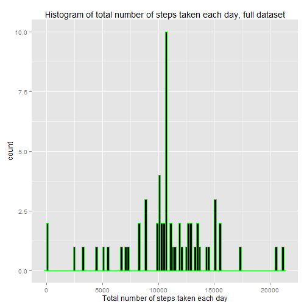
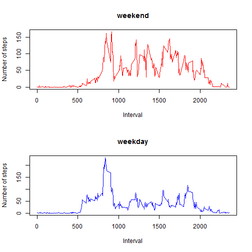

# Peer Assessment 1 for Reproducible Research
11/15/2015

# Introduction
It is now possible to collect a large amount of data about personal movement using activity monitoring devices such as a Fitbit, Nike Fuelband, or Jawbone Up. These type of devices are part of the "quantified self" movement - a group of enthusiasts who take measurements about themselves regularly to improve their health, to find patterns in their behavior, or because they are tech geeks. But these data remain under-utilized both because the raw data are hard to obtain and there is a lack of statistical methods and software for processing and interpreting the data.

This assignment makes use of data from a personal activity monitoring device. This device collects data at 5 minute intervals through out the day. The data consists of two months of data from an anonymous individual collected during the months of October and November, 2012 and include the number of steps taken in 5 minute intervals each day.


## Loading and preprocessing the data
Show any code that is needed to

1. Load the data (i.e. read.csv())

2. Process/transform the data (if necessary) into a format suitable for your analysis


The following code is used to load the data. Preprocessing will be carried on latter on.

```r
d = read.csv("activity.csv")
head(d)
```

```
##   steps       date interval
## 1    NA 2012-10-01        0
## 2    NA 2012-10-01        5
## 3    NA 2012-10-01       10
## 4    NA 2012-10-01       15
## 5    NA 2012-10-01       20
## 6    NA 2012-10-01       25
```

# What is mean total number of steps taken per day?

For this part of the assignment, you can ignore the missing values in the dataset.

1. Calculate the total number of steps taken per day

2. If you do not understand the difference between a histogram and a barplot, research the difference between them. Make a histogram of the total number of steps taken each day

3. Calculate and report the mean and median of the total number of steps taken per day


The code for Calculating the total number of steps taken per day and making a histogram of the total number of steps taken each day is shown below.


```r
library(ggplot2)

data_steps = d$steps
data_date = d$date
data_total = aggregate(data_steps ~ data_date, FUN = sum, na.action = na.omit)

qplot(data_total$data_steps,
      geom="histogram",
      main = "Histogram of total number of steps taken each day", 
      xlab = "Total number of steps taken each day",
      binwidth = 200,
      fill=I("blue"), 
      col=I("red"))
```

 


The code for calculating and reporting the mean of the total number of steps taken per day is shown as below:


```r
mean_steps_each_day = mean(data_total$data_steps)
mean_steps_each_day
```

```
## [1] 10766.19
```


The code for calculating and reporting the median of the total number of steps taken per day is shown as below:


```r
median_steps_each_day = median(data_total$data_steps)
median_steps_each_day
```

```
## [1] 10765
```


##What is the average daily activity pattern?

1. Make a time series plot (i.e. type = "l") of the 5-minute interval (x-axis) and the average number of steps taken, averaged across all days (y-axis)

2. Which 5-minute interval, on average across all the days in the dataset, contains the maximum number of steps?


The following code shows steps for making a time series plot of the 5-minute interval (x-axis) and the average number of steps taken, averaged across all days (y-axis).


```r
data_interval = d$interval
data_interval_average = aggregate(data_steps ~ data_interval, FUN = mean, na.action = na.omit)

plot(data_interval_average$data_interval,
      data_interval_average$data_steps,
      type="l",
      main = "Time series plot ", 
      xlab = "The 5-minute interval",  
      ylab = "Average number of steps averaged across all days",
      col="blue")
```

 

The 5-minute interval containing the maximum number of steps is reported as below.


```r
data_interval_average$data_interval[which.max(data_interval_average$data_steps)]
```

```
## [1] 835
```

## Imputing missing values

Note that there are a number of days/intervals where there are missing values (coded as NA). The presence of missing days may introduce bias into some calculations or summaries of the data.

1. Calculate and report the total number of missing values in the dataset (i.e. the total number of rows with NAs)

2. Devise a strategy for filling in all of the missing values in the dataset. The strategy does not need to be sophisticated. For example, you could use the mean/median for that day, or the mean for that 5-minute interval, etc.

3. Create a new dataset that is equal to the original dataset but with the missing data filled in.

4. Make a histogram of the total number of steps taken each day and Calculate and report the mean and median total number of steps taken per day. Do these values differ from the estimates from the first part of the assignment? What is the impact of imputing missing data on the estimates of the total daily number of steps?


To get the total number of missing values, I first check the dimension of the datasets, and check the missing values in "date"" and "interval"" columns. I find that there is no missing value in "date"" and "interval".


```r
dim(d)
```

```
## [1] 17568     3
```

```r
length(which(is.na(d$date)))
```

```
## [1] 0
```

```r
length(which(is.na(d$interval)))
```

```
## [1] 0
```

I then check the number of missing values in "steps" and find that there are 2304 missing values there. This is also the total number of rows with NAS in the whole dataset.


```r
length(which(is.na(d$steps)))
```

```
## [1] 2304
```

To fill in all of the missing values in the dataset, I use the mean for that 5-minute interval. I check the value of "steps" one by one. If the value is NA, replace it with mean for the corresponding interval. The code for impelmenting this proceduring and getting the new dataset is shown below.


```r
new_data <- d
new_steps = new_data$steps
for (i in 1 : length(new_steps)) {
  if(is.na(new_steps[i])) {
    index = match(new_data$interval[i], data_interval_average$data_interval)
    new_data$steps[i] = data_interval_average$data_steps[index]
  }
}
head(new_data)
```

```
##       steps       date interval
## 1 1.7169811 2012-10-01        0
## 2 0.3396226 2012-10-01        5
## 3 0.1320755 2012-10-01       10
## 4 0.1509434 2012-10-01       15
## 5 0.0754717 2012-10-01       20
## 6 2.0943396 2012-10-01       25
```


The histogram of the total number of steps taken each day using the new dataset where the missing values are filled in is shown below. 


```r
new_data_steps = new_data$steps
new_data_date = new_data$date
new_data_total = aggregate(new_data_steps ~ new_data_date, FUN = sum, na.action = na.omit)
qplot(new_data_total$new_data_steps,
      geom="histogram",
      main = "Histogram of total number of steps taken each day, full dataset", 
      xlab = "Total number of steps taken each day",  
      binwidth = 200,
      fill=I("black"), 
      col=I("green"))
```

 

The mean of the total number of steps taken per day using new dataset is reported as below:


```r
new_mean_steps_each_day = mean(new_data_total$new_data_steps)
new_mean_steps_each_day
```

```
## [1] 10766.19
```

The median of the total number of steps taken per day using new dataset is reported as below:


```r
new_median_steps_each_day = median(new_data_total$new_data_steps)
new_median_steps_each_day
```

```
## [1] 10766.19
```

The histogram with the new dataset differs from the first part of the assignment. The mean value keeps the same. The median value varies a little from the one using the old dataset. Imputing missing data increases the overall counts of total daily number of steps, which makes sense because the missing values which were ignored in the first part are now replaced with meaningful values.


## Are there differences in activity patterns between weekdays and weekends?

For this part the weekdays() function may be of some help here. Use the dataset with the filled-in missing values for this part.

1. Create a new factor variable in the dataset with two levels - "weekday" and "weekend" indicating whether a given date is a weekday or weekend day.

2. Make a panel plot containing a time series plot (i.e. type = "l") of the 5-minute interval (x-axis) and the average number of steps taken, averaged across all weekday days or weekend days (y-axis). See the README file in the GitHub repository to see an example of what this plot should look like using simulated data.

In the dataset where the missing values are filled in, I add a new column named "day_type" to indicate whether a given date is a weekday or weekend day. The code is shown as below.

```r
new_data$date <- as.Date(new_data$date)
weekdays0 <- c('Monday', 'Tuesday', 'Wednesday', 'Thursday', 'Friday')
new_data$day_type <- factor((weekdays(new_data$date) %in% weekdays0), levels = c(FALSE, TRUE), labels = c('weekend', 'weekday'))
head(new_data)
```

```
##       steps       date interval day_type
## 1 1.7169811 2012-10-01        0  weekday
## 2 0.3396226 2012-10-01        5  weekday
## 3 0.1320755 2012-10-01       10  weekday
## 4 0.1509434 2012-10-01       15  weekday
## 5 0.0754717 2012-10-01       20  weekday
## 6 2.0943396 2012-10-01       25  weekday
```

To compare the difference in the average number of steps taken on weekdays with that taken on weekends, I first divid the data into two groups based on the two levels of days.

The following code shows the step for getting the average number of steps taken on weekdays.


```r
new_data_weekday = new_data[which(new_data$day_type == "weekday"),]
new_data_steps_weekday = new_data_weekday$steps
new_data_date_weekday = new_data_weekday$date
new_data_interval_weekday = new_data_weekday$interval
new_data_interval_average_weekday = aggregate(new_data_steps_weekday ~ new_data_interval_weekday, FUN = mean, na.action = na.omit)
```


The following code shows the step for getting the average number of steps taken on weekends.


```r
new_data_weekend = new_data[which(new_data$day_type == "weekend"),]
new_data_steps_weekend = new_data_weekend$steps
new_data_date_weekend = new_data_weekend$date
new_data_interval_weekend = new_data_weekend$interval
new_data_interval_average_weekend = aggregate(new_data_steps_weekend ~ new_data_interval_weekend, FUN = mean, na.action = na.omit)
```

The following code shows the step for making the plot containing a time series plot of the 5-minute interval (x-axis) and the average number of steps taken, averaged across all weekday days or weekend days (y-axis). 


```r
par(mfrow=c(2,1))
plot(new_data_interval_average_weekend$new_data_interval_weekend,
    new_data_interval_average_weekend$new_data_steps_weekend,
    type="l",
    main = "weekend",
    xlab = "Interval",  
    ylab = "Number of steps",
    col="red")

plot(new_data_interval_average_weekday$new_data_interval_weekday,
     new_data_interval_average_weekday$new_data_steps_weekday,
     type = "l", 
     main = "weekday", 
     xlab = "Interval",  
     ylab = "Number of steps",
     col="blue")
```

 


The above plot shows the average steps taken on weekdays differ from that taken on weekends.
